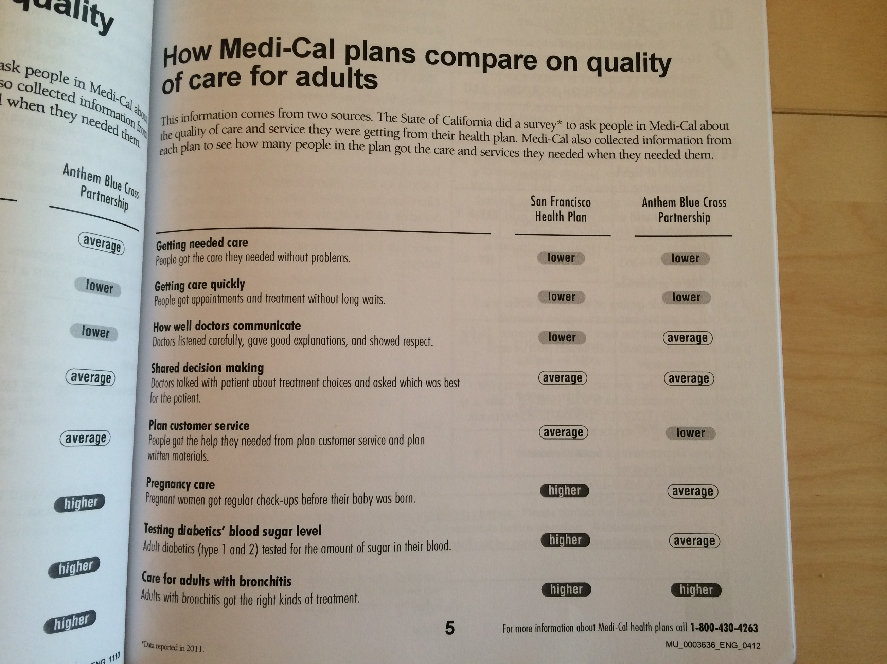

title: The User Experience of CalFresh (and a little Medi-Cal)
style: ../styles.css
output: index.html
controls: true

--
# How CalFresh Works

--
### No, not like this

--
# The User Experience of CalFresh*
   
*(and a little Medi-Cal)

--
# [Apply](http://citizenonboard.com/snap/ca)

--
### Find retailers
<video controls style="margin-left: 25%;">
  <source src="media/ebt.mp4" type="video/mp4">
</video>

--
### Find ATMs

--
### Check your balance

--
### Check your balance

--
### Check your balance
<audio controls>
  <source src="media/balance.mp3" type="audio/mpeg">
</audio>

--
# [The NOAs](http://lippytak.github.io/calfresh/)

--
### Small Things > Big Things
- Participation
- Churn
- Surcharges

--
# Medi-Cal Unboxing
## [(iPhone 3gs)](http://youtu.be/r6tutMa1I2g?t=1m33s)

--
## **9:45 AM**
Cracking the cover of a big booklet

--
## **9:46 AM**
Turns out there is a critical letter inside

--
## **9:48 AM**
Then its right to the forms.

--
## **9:50 AM**
It's like the SATs.

--
## **9:54 AM**
Interesting and vague plan comparisons...

Looks like both plans are lower than average on the metrics I really care about...

Alright I'm going to head back to the Medi-Cal Choice Form
--
## **10:05 AM**
Now I'm filling out the Health Information Form because I want to get something done and am not sure which plan to pick yet or what the doctor code business is...

--
## **10:16 AM**
Ok so time to crack open the Provider Directory.

--
## **10:18 AM**
Hmmmm I'm pretty unsure about how to pick a doctor.

--
## **10:18 AM**
They have them organized by neighborhood

--
## **10:18 AM**
They have them organized by neighborhood

so I can like, see doctors in the Sunset that speak different languages.

--
## **10:18 AM**
They have them organized by neighborhood

so I can like, see doctors in the Sunset that speak different languages.

I could google each of them I guess and try to figure out more.
--
## **10:18 AM**
They have them organized by neighborhood

so I can like, see doctors in the Sunset that speak different languages.

I could google each of them I guess and try to figure out more.

Do I have to pick a doctor right now?
--
## **10:18 AM**
They have them organized by neighborhood

so I can like, see doctors in the Sunset that speak different languages.

I could google each of them I guess and try to figure out more.

Do I have to pick a doctor right now?

f* it im calling...

--
## **10:35 AM**
This phone tree is dense
--
## **10:35 AM**
This phone tree is dense

They have aggressive country light rock hold music playing through a bad speaker
--
## **10:35 AM**
This phone tree is dense

They have aggressive country light rock hold music playing through a bad speaker

its really up tempo
--
## **10:35 AM**
This phone tree is dense

They have aggressive country light rock hold music playing through a bad speaker

its really up tempo

no estimate of hold time
--
## **10:35 AM**
This phone tree is dense

They have aggressive country light rock hold music playing through a bad speaker

its really up tempo

no estimate of hold time

the music gets interrupted every 2 minutes to tell me that 'this call is very important, please continue to hold until the next available customer service representative is available'
--
## **10:35 AM**
This phone tree is dense

They have aggressive country light rock hold music playing through a bad speaker

its really up tempo

no estimate of hold time

the music gets interrupted every 2 minutes to tell me that 'this call is very important, please continue to hold until the next available customer service representative is available'

press 1 to request a call back - thats interesting
--
## **10:35 AM**
This phone tree is dense

They have aggressive country light rock hold music playing through a bad speaker

its really up tempo

no estimate of hold time

the music gets interrupted every 2 minutes to tell me that 'this call is very important, please continue to hold until the next available customer service representative is available'

press 1 to request a call back - thats interesting

we have someone!

--
## **10:45 AM**
...

--
## **10:45 AM**
...

I am being referred to a county worker

--
## **10:45 AM**
...

I am being referred to a county worker

I keep asking why I would choose a doctor or not, but the person on the line doesn't really have any info

--
## **10:45 AM**
...

I am being referred to a county worker

I keep asking why I would choose a doctor or not, but the person on the line doesn't really have any info

calling the county...

--
## **10:56 AM**
sounds like I'll be on hold for more than 40 minutes

--
## **10:56 AM**
sounds like I'll be on hold for more than 40 minutes

ugh I'll call calfresh instead.
--
## **10:56 AM**
sounds like I'll be on hold for more than 40 minutes

ugh I'll call calfresh instead.

...
--
## **10:56 AM**
sounds like I'll be on hold for more than 40 minutes

ugh I'll call calfresh instead.

...

so that took just 10 minutes
--
## **10:56 AM**
sounds like I'll be on hold for more than 40 minutes

ugh I'll call calfresh instead.

...

so that took just 10 minutes

talked to a Calfresh worker, and now they are transferring me to Medi-cal
--
## **10:56 AM**
sounds like I'll be on hold for more than 40 minutes

ugh I'll call calfresh instead.

...

so that took just 10 minutes

talked to a Calfresh worker, and now they are transferring me to Medi-cal

I may have found a short cut... :grinning:
--
## **10:56 AM**
sounds like I'll be on hold for more than 40 minutes

ugh I'll call calfresh instead.

...

so that took just 10 minutes

talked to a Calfresh worker, and now they are transferring me to Medi-cal

I may have found a short cut... :grinning:

that didnt work
--
## **10:56 AM**
sounds like I'll be on hold for more than 40 minutes

ugh I'll call calfresh instead.

...

so that took just 10 minutes

talked to a Calfresh worker, and now they are transferring me to Medi-cal

I may have found a short cut... :grinning:

that didnt work

I was transferred to the desk where they are helping people who came in I guess?
--
## **10:56 AM**

she said she had no computer
--
## **10:59 AM**
she said she had no computer

argh
--
## **10:56 AM**
she said she had no computer

argh

just got routed back to the same queue
--
## **10:56 AM**
she said she had no computer

argh

just got routed back to the same queue

over 40 minute wait time
--
## **10:56 AM**
she said she had no computer

argh

just got routed back to the same queue

over 40 minute wait time

...
--
## **11:50 AM**

just picked up at 38 minutes
--
## **11:50 AM**

just picked up at 38 minutes

"the site that I have to check is down"
--
## **11:50 AM**

just picked up at 38 minutes

"the site that I have to check is down"

"it's everybodys computer"
--
## **11:50 AM**

just picked up at 38 minutes

"the site that I have to check is down"

"it's everybodys computer"

"I'm sorry its not coming up"
--
## **11:50 AM**

just picked up at 38 minutes

"the site that I have to check is down"

"it's everybodys computer"

"I'm sorry its not coming up"

"It's been down for at least 15 minutes now"
--
## **11:50 AM**

just picked up at 38 minutes

"the site that I have to check is down"

"it's everybodys computer"

"I'm sorry its not coming up"

"It's been down for at least 15 minutes now"

"call us this afternoon? Or call us early in the morning tomorrow. There is no traffic at 8 o clock"
--
## **12:02 PM**
**:disappointed:** im done for the day...

--
# Reflections

--
# Thanks!
##[jacob@codeforamerica.org](mailto://jacob@codeforamerica.org)