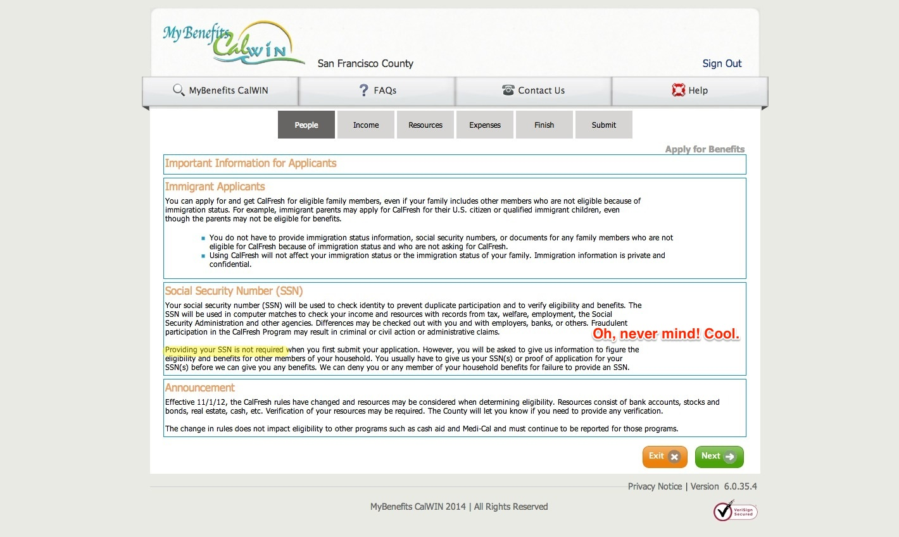

title: CalFresh at Code for America
style: ../styles.css
output: index.html
controls: true

--
# CalFresh at Code for America

--
### Today
- Our work
- Your work
- Work together

--
### The CalFresh Experience
- Aware
- Decide
- Apply
- Interview
- Verify
- Get EBT
- Use EBT
- Stay enrolled
    - SAR-7
    - RRR

--
### App - ES

--
### App - SSN

--
### App - SSN

--
### App - SSN

--
### App - Submit?

--
### App - GIF

--
### NOA

--
### NOA

--
### Surveys
- Applicant - "The website may have moved address. The website may be down for maintenance...I tried other websites but it says it's not available in my county"

--
### Surveys
- Applicant - "The website may have moved address. The website may be down for maintenance...I tried other websites but it says it's not available in my county"
- New client - "Is this April and May or just April? Just my emergency funds? I just don't want to spend it all and it's not clear."

--
### Surveys
- Applicant - "The website may have moved address. The website may be down for maintenance...I tried other websites but it says it's not available in my county"
- New client - "Is this April and May or just April? Just my emergency funds? I just don't want to spend it all and it's not clear."
- EW - "In terms of phone interview, I would say it is because clients are not available during interview times. The interviews are scheduled in a 4 hour time span and most of the time client will not even be called in that 4 hour time period if we have overflow."

--
### Services
- Balance
- Connect
- [EBTNearMe](www.ebtnearme.org)
- [CleanAssist](demo.cleanassist.org)

--
### Clean Assist
<iframe src="https://public.ducksboard.com/w/cW52JR56fUe1cyA6D71N" width="600" height="600" frameborder="0" scrolling="no" style="border: solid rgba(243, 243, 232, 0.701961) 10px; border-radius: 5px; -moz-box-sizing: content-box; -webkit-box-sizing: content-box; box-sizing: content-box;"></iframe>

--
### Clean Assist
- Over 1/2 of initial calls missed
- Over 1/2 EBT cards picked up in person
- Some cards issued and never used

--
# Your work

--
### Work together
- Research
- Implement
- Evaluate

(build-measure-learn loop)