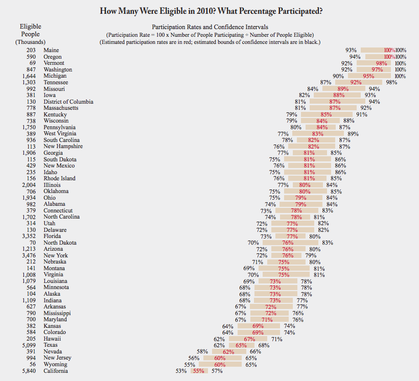

title: YTH Live
style: ../styles.css
output: index.html
controls: false

--
# YTH Live
1. Me.
2. Macro.
3. Micro.

--
### Palantir

via [Palantir](http://www.palantir.com/2010/04/haiti-effective-recovery-through-analysis/)

--
### RAND

via [NBER](http://www.nber.org/oregon/)

--
### RAND

via [NBER](http://www.nber.org/oregon/)

--
### Macro CalFresh
[Time - SNAP enrollment](http://swampland.time.com/2013/12/04/interactive-republicans-more-likely-to-have-constituents-who-use-food-stamps/)

--
### Macro CalFresh

via [FNS](http://www.fns.usda.gov/sites/default/files/Reaching2010.pdf)

--
### Macro CalFresh

via [FNS](http://www.fns.usda.gov/sites/default/files/Reaching2010.pdf)

--
### Disconnect

--
### Micro CalFresh
- [Here's how to apply for CalFresh online](http://codeforamerica.github.io/citizen-onboard/calfresh/#7)

- [And here's what happens after you're enrolled](http://lippytak.github.io/calfresh/)

--
### Promptly

--
# More?
Join CfA Peer Network at [www.codeforamerica.org/cities](http://www.codeforamerica.org/cities)

Questions? Reach out [@lippytak](http://www.twitter.com/lippytak).